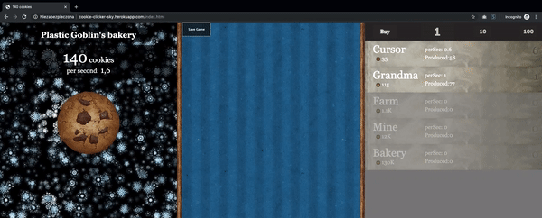

# **Cookie Clicker**

A project based on cookie clicker game http://orteil.dashnet.org/cookieclicker/

---


---
## **Requirements**

For development, you will only need Node.js installed on your environement.

### Node

[Node](http://nodejs.org/) is really easy to install & now include [NPM](https://npmjs.org/).
You can use [YARN](https://yarnpkg.com) instead of npm if you like.
You should be able to run the following command after the installation procedure
below.
```sh
    $ node --version
    v0.10.24

    $ npm --version
    1.3.21
```

#### Node installation on OS X

You will need to use a Terminal. On OS X, you can find the default terminal in
`/Applications/Utilities/Terminal.app`.

Please install [Homebrew](http://brew.sh/) if it's not already done with the following command.
```sh
    $ ruby -e "$(curl -fsSL https://raw.github.com/Homebrew/homebrew/go/install)"
```
If everything when fine, you should run
```sh
    brew install node
```
#### Node installation on Linux
```sh
    sudo apt-get install python-software-properties
    sudo add-apt-repository ppa:chris-lea/node.js
    sudo apt-get update
    sudo apt-get install nodejs
```

#### Node installation on Windows

Just go on [official Node.js website](http://nodejs.org/) & grab the installer.
	Also, be sure to have `git` available in your PATH, `npm` might need it.

---

## **Install**
```sh
    $ git clone https://github.com/piotpap663/cookieclick.git
    $ cd cookieclick-master

    $ npm install
    #or
    $ yarn install
```
---

## **Getting started**
```sh
    $ npm dev-server

    #or if you use yarn
    
    $ yarn run dev-server
```
It will run app on localhost server
Just check the ip and port on your command lines
Put the address in your browser and it'll works

##### **Default address:**

	localhost:8080

---
## **Development**

### Adding new producer "grandpa"
```html
	# Add new div element to index.html
	<div id="producer-grandpa" class="producer"></div>
```
##### Add producer declaration into game.js file
```
	# constructor values
	# new Producer(DOMid, name, baseCost, perSecond);
	# DOMid - element id [string], 
	# name - name of producer [string], 
	# baseCost - cost for buying one producer, 
	# perSecond - How many cookies produce per one second
```
```javascript
	const grandpa= new Producer("producer-grandpa", "Grandpa", 130000, 260);
	
	game.listOfProducers.push(grandpa);
```
---
## **Rendering intervals**

	Inside constructor of Game class you will find a time intervals declaration 
	
	renderProducersTime - rendering List of Producers
	renderBigCookieTime  - rendering how many cookies we have
	
```javascript
#game.js

class Game {
	constructor() {
		this.renderProducersTime = 400; // ms
	  this.renderBigCookieTime = 100; // ms
	}
```
---
## **Simple build for production**
```javascript
    $ npm build

    #or if you use yarn
    
    $ yarn run build
```

---

## **Author**

* **Piotr Papiernik** - [LinkedIn](https://linkedin.com/in/piotr-papiernik/) 

---

## **License**

	This project is licensed under the MIT License
